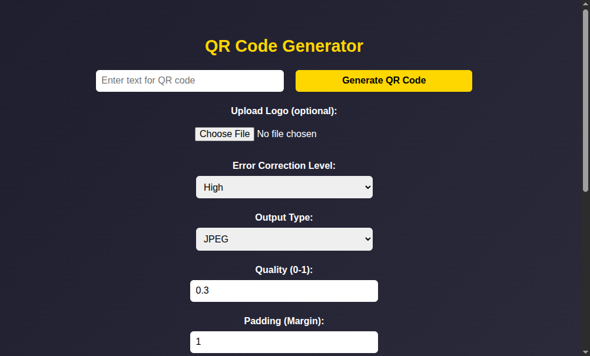

# 🧾 QR Code Generator

A free, customizable, and responsive QR code generator built with **HTML**, **CSS**, and **JavaScript**. Create your own QR codes with color options, logo upload, and image downloads — no backend required.

---

## ✨ Features

- ✅ Generate QR codes with custom text  
- 🎨 Choose your own colors (foreground & background)  
- 🖼️ Add your own logo at the center  
- 📐 Customize size, margin, and output quality  
- 📁 Download in PNG, JPEG, or SVG format  
- 📱 Fully responsive and mobile-friendly  

---

## 🚀 Live Demo

🔗 [Visit the Live Demo](https://qrcodegenerator-dusky.vercel.app)

---

## 📷 Preview

---

## 🛠️ Technologies Used

- HTML5  
- CSS3  
- JavaScript  

---

## 🙌 Author

Made with ❤️ by **Michael Entera**  

---

## 📄 License

This project is free and open-source. Use it, customize it, and share it freely.
